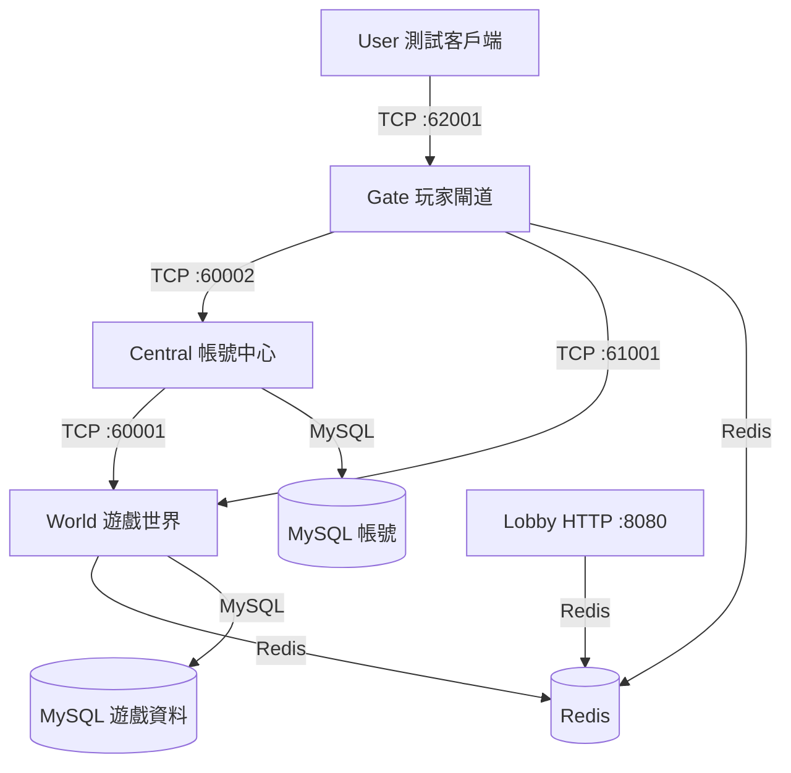
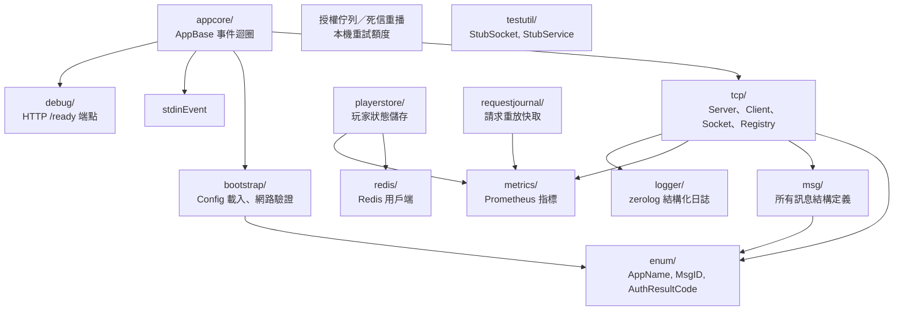

# 模組關係

## 網路通訊拓撲

## 連線角色

| 服務 | 被動服務（ServiceServer） | 主動服務（ServiceClient） |
|------|----------------------|------------------------|
| Central | World(:60001), Gate(:60002) | — |
| Gate | User(:62001) | Central, World |
| World | Gate(:61001) | Central |
| Lobby | — | 僅使用 Redis（HTTP 服務，無 TCP） |
| User | — | Gate |

> Gate 同時扮演 Server（對 User）和 Client（對 Central／World）。
>
> User 雖然放在 PJA-Server 專案內，網路角色仍是 Client；它不使用 S2S 端點。

## Lobby HTTP 端點

| 端點 | 方法 | 說明 |
|------|------|------|
| `/gates` | GET | 回傳所有 Gate 地址與負載，依負載升序排列 |
| `/centrals` | GET | 回傳所有 Central 地址 |
| `/worlds` | GET | 回傳所有 World 地址 |
| `/notices?after=X` | GET | 回傳序號 X 後仍有效的系統公告 |
| `/admin/kick?playerID=X` | POST | 踢出指定玩家（需 Bearer token） |
| `/admin/ban?account=X&duration=Xh` | POST | 封禁帳號（需 Bearer token） |
| `/admin/unban?account=X` | POST | 解除封禁（需 Bearer token） |
| `/admin/notices` | POST | 建立系統公告（需 ops token） |
| `/admin/notices/{seq}` | DELETE | 撤下系統公告（需 ops token） |

## pkg/ 套件依賴關係

## pkg 邊界

`pkg` 只放跨服務共用、而且不會因單一服務業務演進而頻繁變動的東西。

### 可以放

- `tcpapi`
  - 最小介面
  - 給 `tcpserver`、`tcpclient`、`tcpsocket` 與應用程式之間共用
- `tcpserver`
  - TCP 伺服器執行期協調
  - 設定解析、accept 連線管理
- `tcpclient`
  - TCP 用戶端執行期協調
  - 連線管理、重新連線、限流
- `tcpsocket`
  - frame 編碼／解碼
  - Socket 生命週期
  - 封包收送與佇列管理
- `msg`
  - 協定基礎設施（`protocol.go`、`fast_codec.go`、`RequestMeta` / `TraceMeta` / `ProtocolVersion`）
- `msg/auth`、`msg/chat`、`msg/channel`、`msg/system`
  - 協定訊息 DTO，依領域拆分；呼叫端使用具名匯入（`msgauth` / `msgchat` / `msgchan` / `msgsys`）
- `requestjournal`
  - `(scope, request_id) -> result` 的短期冪等快取
- `pkg/requestjournalredis`
  - journal 的 Redis 後端轉接器
- `policy`
  - timeout／TTL／重試額度
- `metrics`、`logger`、`debug`
  - 觀測與運維，不含業務流程

### 不該放

- 各服務 handler 的業務規則
- MySQL／Redis 的特定領域對應
- 單一服務才會用到的 policy 分支
- 需要跟著玩家流程一起改的狀態機
- 會讓 `pkg` 反過來依賴應用程式的東西

### 判斷原則

1. `pkg` 可以被多個服務直接匯入
2. 單一服務改規則時，不該逼所有應用程式跟著改
3. 只要開始混入業務分支，就應該拆回應用程式或 `internal`

## 各服務對 pkg 套件的使用

| pkg 套件 | Central | Gate | World | Lobby | 說明 |
|-------------|:-------:|:----:|:-----:|:-----:|------|
| tcp | v | v | v | — | 所有 TCP 服務的傳輸層 |
| tcpapi | v | v | v | — | 最小共用介面 |
| appcore | v | v | v | — | 事件迴圈框架 |
| msg | v | v | v | — | 訊息序列化/反序列化 |
| enum | v | v | v | — | 常數定義（MsgID, AuthResultCode） |
| bootstrap | v | v | v | v | 設定檔載入 |
| tcpserver | v | v | v | — | TCP 伺服器執行期 |
| tcpclient | v | v | v | — | TCP 用戶端執行期（含重新連線） |
| tcpsocket | v | v | v | — | Socket／frame 實作層 |
| tcpdiag | v | v | v | — | 協定記錄與查詢 |
| metrics | v | v | v | — | Prometheus 指標 |
| logger | v | v | v | v | zerolog 結構化日誌 |
| 本機重試額度 | v | v | v | v | 只供 World 授權佇列與死信重播使用 |
| debug | v | v | v | v | 健康檢查 HTTP 端點 |
| redis | v | v | v | v | 所有服務（Redis 可用時）均使用 |
| playerstore | — | — | v | v | World 管理在線狀態；Lobby 查詢踢出路由 |
| requestjournal | v | v | v | — | 請求去重（Central 登入、Gate/World 校驗） |
| testutil | — | — | — | — | 僅測試使用 |

## appcore / stdinEvent 的角色

- `appcore.AppBase` 提供事件迴圈、週期性更新與 stdin 指令整合。
- `stdinEvent` 主要在本機開發與 `User` 測試客戶端有感，讓開發者可直接從終端輸入登入／登出指令。
- 四個服務都建立在同一套 appcore 模式上，因此 handler 初始化、定時清掃、健康檢查行為有一致骨架。

## 訊息 ID 分區

Client `MessageID` 的產生來源是 `../PJA-Protocol`；S2S `MessageID` 由
PJA-Server 的 `pkg/protocol/s2s_message_id.go` 維護。下列 `MessageID` 同時
就是 TCP frame 標頭的 ID，不另設 `wire_id`。

| ID 範圍 | 方向 | 說明 |
|---------|------|------|
| 1–999 | Client ↔ Server | PJA-Protocol 既有玩家遊戲流程訊息 |
| 1001–1004 | Client ↔ Gate | Client 驗證與登入恢復鏈路 |
| 2005–2006 | Client ↔ Gate | Client HeartbeatRequest／Response（Luban） |
| 2101–2199 | Client 預留 | 舊頻道操作協定已移除；Server 頻道廣播改走 30403／30404 S2S |
| 2201–2204、2206 | Client ↔ Chat 經 Gate | 聊天加入／離開／傳送／投遞／同步 |
| 2500–29999 | Client 預留 | 新增 Client 訊息更新 PJA-Protocol |
| 30001–30099 | 服務 ↔ 服務 | Server 驗證與登入恢復鏈路 |
| 30101–30199 | 服務 ↔ 服務 | S2S ConnectInfo、HeartbeatReq／Res、TimeSync |
| 30201–30299 | 服務 ↔ Chat | ChatSystem |
| 30301–30399 | 服務 ↔ 服務 | World 轉送、Gate 路由同步 |
| 30401–30499 | Central ↔ 服務 | 稽核快照 |
| 30500–65535 | S2S 預留 | 新增 S2S 訊息更新 Server 註冊表 |

## 相關筆記

- [[系統導讀]]
- [[時序圖]]
- [[World指派策略]]
