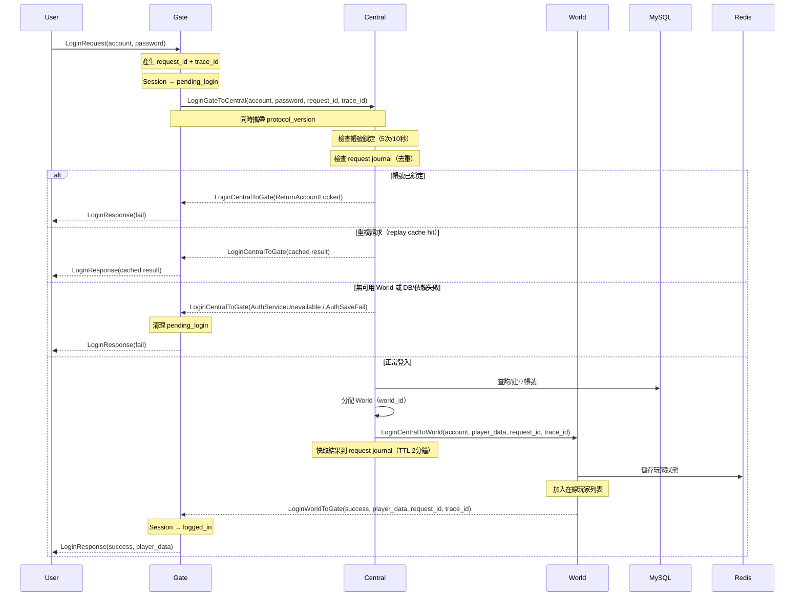
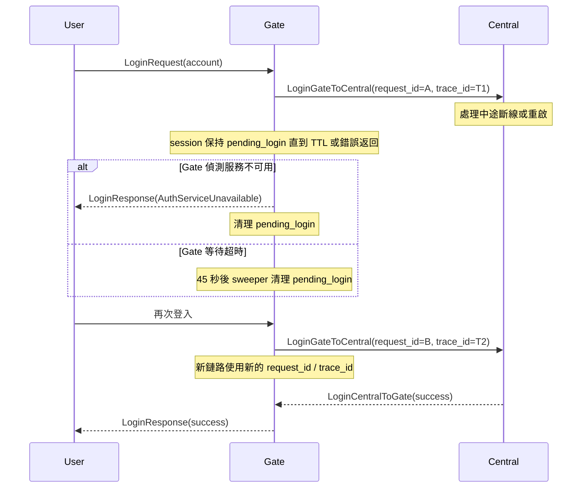
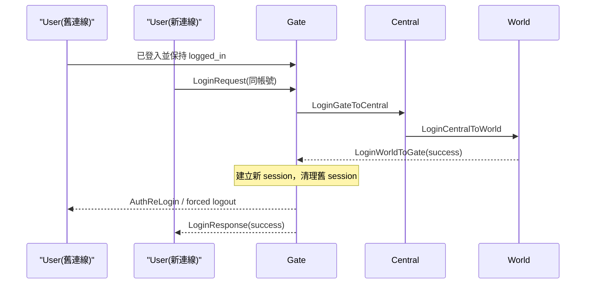
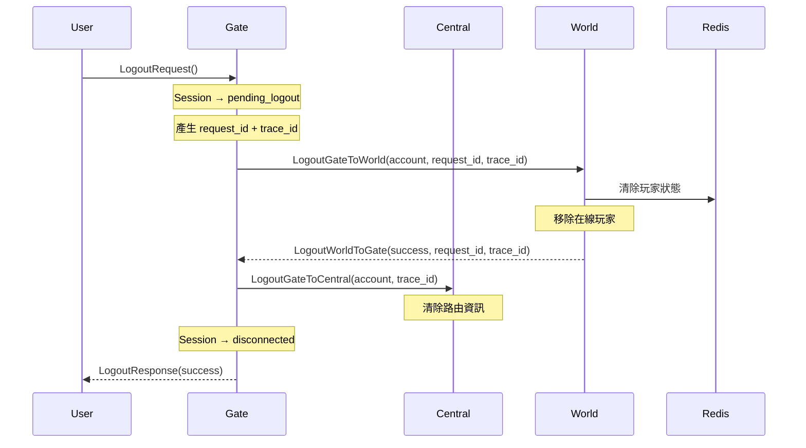
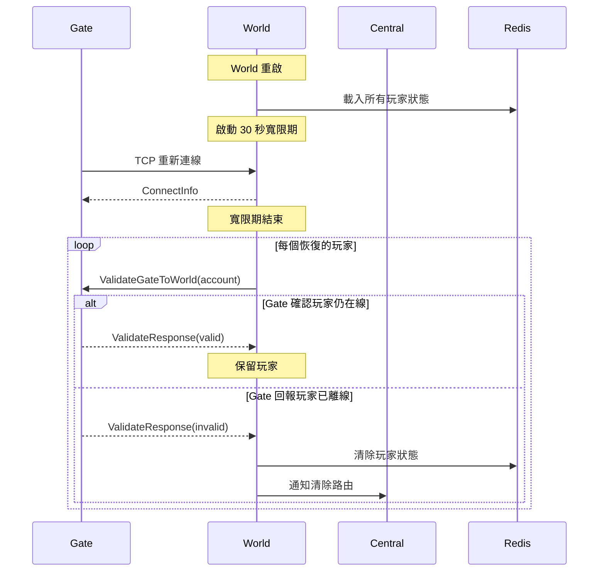
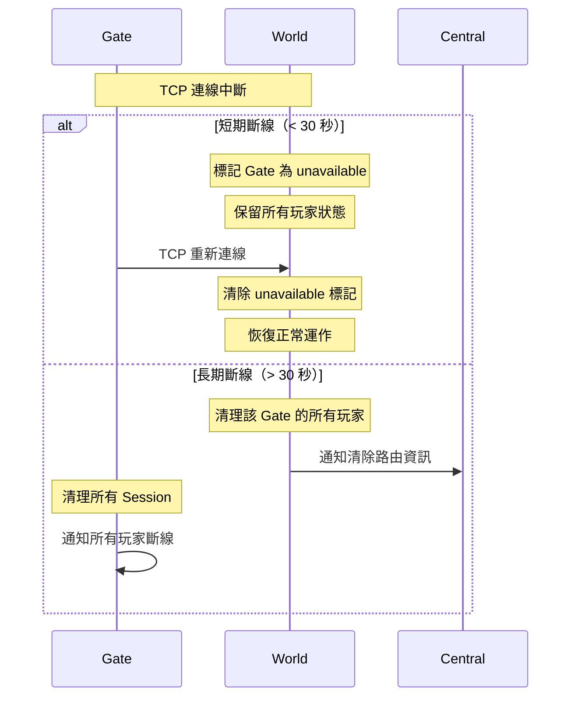
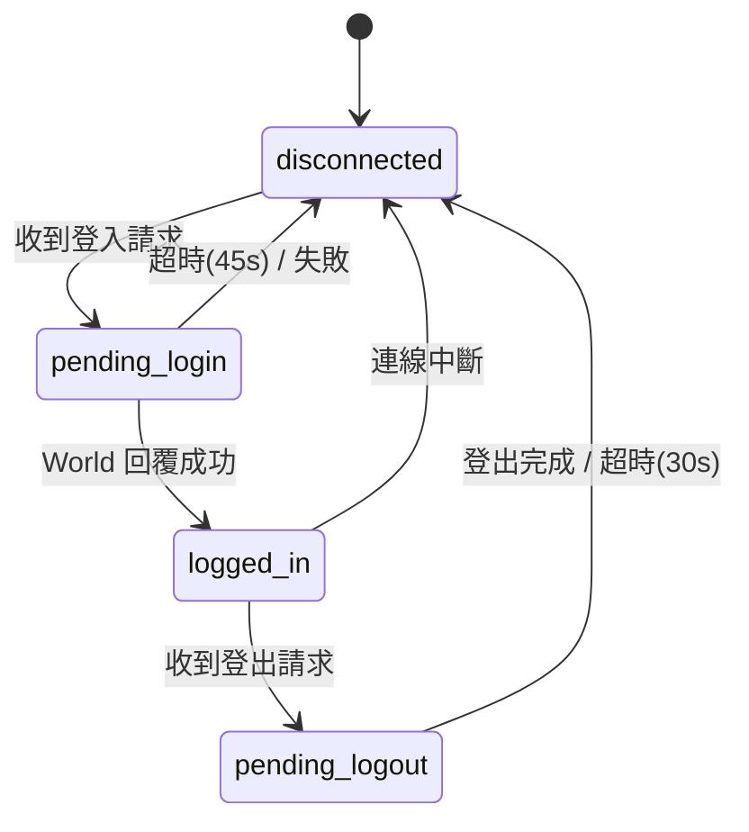
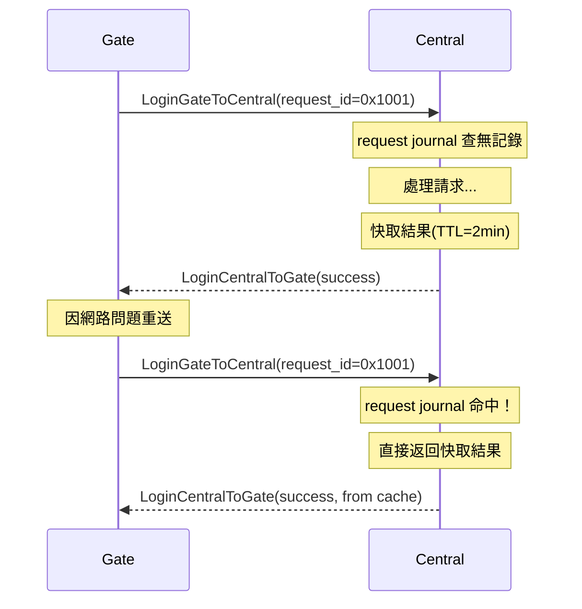

# 時序圖

## 登入流程

## Central 中途失聯後玩家重試

## 重複登入踢舊 Session

## 登出流程

## World 重啟恢復流程

## Gate 與 World 斷線處理

## Session 狀態機

## 請求去重機制

## 相關文件

- [[系統導讀]]
  - 架構總覽、服務角色、資料邊界
- [[模組關係]]
  - 服務拓撲、pkg 套件依賴、訊息 ID 分區
- [[連線與登入流程]]
  - 對照每個時序圖節點的實際規則與責任分工
- [[資料一致性]]
  - 說明圖上的資料歸屬與寫入順序
- [[World指派策略]]
  - 補充登入流程中 World 的指派策略
- [[問題排查筆記]]
  - 對照異常分支與實際故障情境
