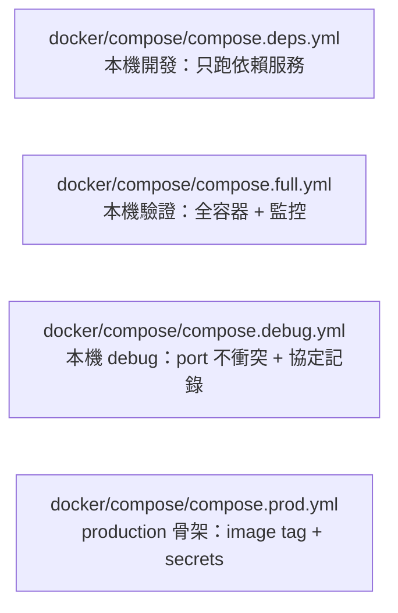

# Docker 生產部署

這份文件涵蓋 production 部署從 compose 骨架到實際上線的完整流程。

## 與其他 compose 的差異



### `docker/compose/compose.deps.yml`

用途：本機 GoLand 開發，只跑依賴服務（MySQL / Redis / RabbitMQ）。

### `docker/compose/compose.full.yml`

用途：本機完整容器驗證，驗證 image build、容器網路、監控串接。

### `docker/compose/compose.debug.yml`

用途：本機完整 debug 容器驗證，可和 `docker/compose/compose.prod.yml` 同機並跑（port 不衝突），`DEBUG_PROTOCOL_RECORD=true` 預設開啟。

### `docker/compose/compose.prod.yml`

用途：production 部署骨架，以 image tag 與 secrets/env 為主，不常駐 `user` client。

---

下面進入 production 部署的完整流程：image build → push → deploy → rollback。

## 1. 準備環境變數

先從：

- [.env.prod.example](../../.env.prod.example)

複製成你自己的 `.env.prod`，並至少修改：

- `MYSQL_ROOT_PASSWORD`
- `MYSQL_PASSWORD`
- `GRAFANA_ADMIN_PASSWORD`
- `REGISTRY`
- `IMAGE_TAG`
- `CENTRAL_IMAGE`
- `WORLD_IMAGE`
- `GATE_IMAGE`

不要把真正的 `.env.prod` 提交到版本庫。

### 環境變數：AUTO_MIGRATE_DISABLED

所有 Go 服務在啟動初期會自動執行 `AutoMigrate` 確保資料表結構與 model 一致。
**生產環境應設 `AUTO_MIGRATE_DISABLED=true`**，由外部 migration 工具（golang-migrate / Flyway / Atlas）管理 schema：

```env
AUTO_MIGRATE_DISABLED=true
```

設定後，以下三個啟動時期的 AutoMigrate 會被跳過：

- `Central` → `user_record` 表
- `Chat` → `chat_messages` 表
- `World` → `player_item` 表

Record 服務的日表預先建立在啟動時獨立進行，不受此變數影響。

### 連線池設定

各服務的 MySQL 連線池採用以下預設值，可透過設定檔覆寫：

| 服務 | MaxOpenConns | MaxIdleConns | ConnMaxLifetime | ConnMaxIdleTime | 設定方式 |
|------|-------------|-------------|----------------|----------------|---------|
| Central (pkg) | 25 | 10 | 1h | 10m | `pkg/mysql.Connect` 內建 |
| Chat | 依 `cfg.MaxOpenConns` | 依 `cfg.MaxIdleConns` | 依 `cfg.ConnMaxLifetime` | 10m | `mysql_connect.go` 覆寫 |
| World | 25（可設 `MaxOpenConns`） | 10（可設 `MaxIdleConns`） | 1h | 10m | `gamedb.Config` 設 >0 時套用 |
| Record | 25 | 10 | 1h | 10m | `services.OpenDB` 內建 |

> World 的 `MaxOpenConns` / `MaxIdleConns` 設為 0 時沿用 pkg 預設值。

## 2. 建 image

```bash
REGISTRY=registry.github.com/koebel0521/project IMAGE_TAG=1.0.0 ./scripts/docker-build-images.sh
```

這會 build：

- `project-central`
- `project-world`
- `project-gate`

## 3. 推 image

```bash
REGISTRY=registry.github.com/koebel0521/project IMAGE_TAG=1.0.0 ./scripts/docker-push-images.sh
```

## 4. 部署

在部署主機上，準備：

- `docker/compose/compose.prod.yml`
- `docker/prod/config/*.yaml`
- `.env.prod`

啟動應用：

```bash
docker compose --env-file .env.prod -f docker/compose/compose.prod.yml up -d
```

若也要監控：

```bash
docker compose --env-file .env.prod -f docker/compose/compose.prod.yml --profile monitoring up -d
```

## 5. 驗證

部署後可先跑：

```powershell
powershell -ExecutionPolicy Bypass -File ./scripts/production-smoke.ps1
```

若有啟用 monitoring profile：

```powershell
powershell -ExecutionPolicy Bypass -File ./scripts/production-smoke.ps1 -CheckMonitoring
```


```bash
docker compose --env-file .env.prod -f docker/compose/compose.prod.yml ps
docker compose --env-file .env.prod -f docker/compose/compose.prod.yml logs --tail 100 central world gate
```

確認：

- `mysql` / `redis` healthy
- `central` / `world` / `gate` healthy
- 若有開監控，`prometheus` / `grafana` up

## 6. 更新版本

1. build 新 tag
2. push 新 tag
3. 修改 `.env.prod` 內的：
   - `IMAGE_TAG`
   - `CENTRAL_IMAGE`
   - `WORLD_IMAGE`
   - `GATE_IMAGE`
4. 重新部署：

```bash
docker compose --env-file .env.prod -f docker/compose/compose.prod.yml up -d
```

## 7. 回滾

如果新版本有問題：

1. 把 `.env.prod` 的 image tag 改回上一版
2. 再執行一次：

```bash
docker compose --env-file .env.prod -f docker/compose/compose.prod.yml up -d
```

因為 compose 以 image tag 為主，所以 rollback 的核心就是把 tag 指回上一個穩定版本。

## 8. 目前邊界

這套 production 部署目前仍是單機骨架，尚未處理：

- TLS / ingress / L4 LB
- secret manager
- 受管 MySQL / Redis
- 多節點部署
- 自動備份與 restore 演練
- CI/CD 自動發版

## 9. 建議順序

若你要真的上線，我建議下一批優先做：

1. DB / Redis 備份腳本
2. deploy 主機目錄結構規範
3. registry login / release 流程
4. production health check / smoke test

## 10. 升級相容性演練

先在 staging 跑 rolling upgrade：

```powershell
powershell -ExecutionPolicy Bypass -File ./scripts/upgrade-compatibility-drill.ps1 -NewTag 1.0.1 -Rollback
```

順序固定：

1. `central`
2. `world`
3. `gate`

每步都會跑 smoke，確認舊新混跑還能起。
`-Rollback` 會在升級完成後再反向退回舊版，驗證回滾也能收斂。

若要比較不同部署方案，先看 [部署方案比較.md](./部署方案比較.md)。

資料備份與還原請參考 [[Docker備份還原]]。


release / version 流程請參考 [[Docker發版流程]]。

版本保留與回收條件請參考 [版本回收策略.md](./版本回收策略.md)。

灰度回退點請參考 [灰度回退點.md](./灰度回退點.md)。
