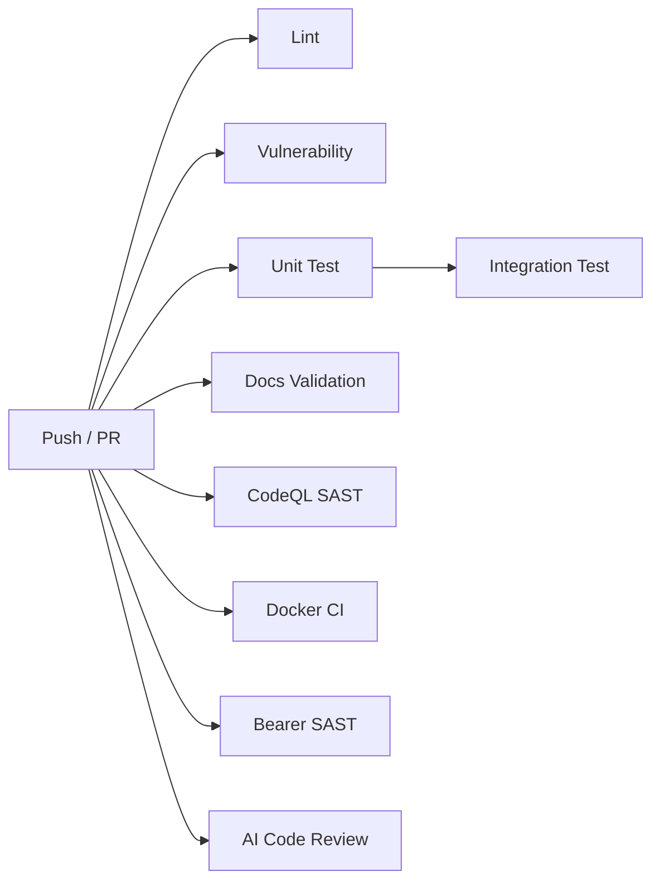

# 開發規則（詳細規範）

本文件保留完整的程式碼、測試、CI、依賴與部署規範；日常操作先從[開發快速入口](開發快速入口.md)開始。

## 內容歸屬

本文件只作規範索引；專題操作以以下文件為準：

- Docker 啟動、部署、備份與發版： [Docker 全堆疊](Docker全堆疊.md)、[Docker 生產部署](Docker生產部署.md)、[Docker 備份還原](Docker備份還原.md)、[Docker 發版流程](Docker發版流程.md)
- 依賴工具： [依賴管理](tools/依賴管理.md)
- 監控與指標： [本機監控](../20-排障與監控/本機監控.md)、[指標面板](../20-排障與監控/指標面板.md)
- 配置發布與遷移： [配置操作入口](配置操作入口.md)、[配置 Migration](配置Migration.md)

腳本一覽先看 [腳本總覽](./腳本總覽.md)，工具一覽先看 [工具總覽](./工具總覽.md)；這頁保留開發與部署規則本體。

## 程式碼慣例

### Handler 模式

所有訊息處理器遵循統一簽名：

```go
func (r *Event) onMessageType(svc IService, sock ISocket, m *Message)
```

- 第一個參數 `svc` — 來源服務
- 第二個參數 `sock` — 來源連線
- 第三個參數 `m` — 訊息本體

#### traceID 自動注入

dispatch 層（`pkg/tcpsocket/socket_async.go` 的 `msgEvent.Run()`）會自動從實作 `msg.TraceScopedMessage` 的訊息中提取 `traceID` 並注入 `sock.Context()`。Handler 不需要手動呼叫 `logger.WithTraceID`：

```go
// 正確 — traceID 已由 dispatch 層自動注入
func (r *Event) onLoginGateToCentral(svc tcpruntime.Service, sock tcpruntime.Socket, m *msgauth.LoginGateToCentral) {
	defer metrics.ObserveHandlerDuration("central", "on_login_gate_to_central")()
	ctx, endSpan := tracing.StartSpan(sock.Context(), 0, "central.login", "account", m.Account)
	defer endSpan()
	logger.InfoCtx(ctx, "login request", "account", m.Account)
}
```

- `sock.Context()` 已自帶 `traceID`，無需 `logger.WithTraceID`
- `tracing.StartSpan(ctx, 0, ...)` 會從 ctx 自動讀取 `traceID`
- 背景 goroutine／非訊息入口處仍需手動 `logger.WithTraceID`
- 建立新 trace 的入口點（如 `forward.go`）仍手動呼叫 `NextTraceID`

#### 指標記錄

每個 Handler 必須記錄：
- **執行時間** — `game_handler_duration_seconds` histogram（使用 `metrics.ObserveHandlerDuration`）
- **結果碼** — success/fail label

### 日誌規範

- 以 [`日誌規範`](./日誌規範.md) 為準
- 新程式碼統一使用 `pkg/logger`，底層固定 `zerolog`
- 不要直接引入 `log/slog`、`logrus`、`zap` 作為新日誌入口
- 跨服務訊息必須攜帶 `trace_id` 欄位

### 錯誤處理

- 錯誤回應必須**立即發送**，避免玩家超時等待
- 所有 error 必須處理（errcheck linter 強制）
- error 回傳應包裹上下文語意（wrapcheck linter 強制）`fmt.Errorf("operation: %w", err)`
- 禁止 bare `fmt.Errorf("%w", err)` 空包裝（等同 `return err` 但多一次 allocation）
- 例外：`io.Closer.Close()` 和 `*sql.DB.Close()`

### 管理端權限

- Lobby 管理端依權限分層：`admin / ops / gm`
- `admin` 可通過所有管理端路由
- `ops` 用於踢人、封禁與世界維護
- `gm` 用於發道具與死信處理
- 新增管理端 API 時，先想好該掛哪一層，不要全塞進同一把 token

### 訊息關聯

- `request_id` — 用於請求去重（同一操作重送時保持不變）
- `trace_id` — 用於日誌串聯（每次新請求產生新 ID）
- 兩者分離，職責不同

### 效能慣例

- **TCP 層**：收發熱路徑用 `DecodePooled`/`WriteFrame`（sync.Pool + net.Buffers 零拷貝），不用 `Decode`/`BuildFrame`
- **Socket 連線**：發送佇列用原生 `chan IMsg`（容量 256），不引入第三方無界佇列
- **World 狀態**：按領域取對應的 `userMu`/`chanMu`，不可直接取 `mu`（已移除）
- **World user 查詢**：`map[uint64]*User` O(1)，不再用 rbtree
- **線上人數**：讀 `activePlayerCount.Load()`，不可遍歷 users map
- **atomic.Bool**：布林原子操作統一用 `sync/atomic.Bool`（Go 1.19+），不用 `gtype.Bool`
- **頻道訊息**：用 `ChannelMembers` + `FindUsersGateMap` 批次查詢，不可在迴圈內逐一 `FindUser`
- **Redis 批次**：大量 key 操作（如 Refresh、Restore）必須走 pipeline，不可循序單條呼叫
- **msgpool**：`Pack()` 緩衝走 `sync.Pool`，不可每次 `make([]byte)`
- **UnsafeAppendString**：登入等熱路徑字串解碼用 `msg.UnsafeAppendString`，避免 `string([]byte)` heap 分配
- **sync.Pool 歸還**：從 pool 取新物件替換舊物件時，舊的必須先 `Put()` 歸還
- **Redis 客戶端**：RESP3 預設啟用，不設 `AlwaysRESP2`/`DisableCache`；由建立連線的啟動層負責在服務結束時呼叫 `Close()`
- **goroutine**：fire-and-forget 必須掛 `sync.WaitGroup`，Release 路徑需 `Wait()`
- **AMQP 順序**：publisher `Run()` 與 `Close()` 必須同一 goroutine 依序執行，不可 race channel 關閉
- **型別斷言**：一律用 comma-ok 模式，裸斷言會 panic

### 程式碼品質

- **Getter 命名**：Go 慣例省略 `Get` 前綴，直接以欄位名作為方法名（`PlayerID()` 而非 `GetPlayerID()`）。
- **錯誤訊息大小寫**：Go 錯誤訊息必須全小寫（含縮寫），`"invalid user id"` 而非 `"invalid playerID"`。
- **Context.Background 禁止用於生產路徑**：應使用 `sock.Context()` 或 `ctx` 參數傳入的 app context，確保 shutdown 能正確取消進行中的作業。
- **HTTP request 日誌**：所有 HTTP server（lobby、record）的 Handler 應包 `httpx.Logging(handler)`，自動記錄 method/path/status/elapsed_ms。
- **Pool 物件的 slice 賦值須拷貝**：從 pool 取得的訊息物件的 `[]byte` 欄位傳遞給非同步 consumer 時，必須拷貝 backing array（`dst = append(dst[:0], src...)`），避免 pool 回收後 backing array 被重寫導致的 data race。
- **context 參數禁止捨棄**：函式簽名收到 `ctx context.Context` 時必須使用，不得命名為 `_`。若底層 API 不支援 context，應自行包裝逾時控制（如 `dialWithContext` 模式）。
- **goroutine 安全**：所有 `go func()` 內部必須 `defer appcore.RecoverPanic("描述")`，避免單一 goroutine panic 拖垮整個 process。禁止直接寫 `recover()` — 統一用 `appcore.RecoverPanic` 確保 stack trace 被正確記錄。
- **長期迴圈 goroutine 使用 per-iteration recover**：無限 `for` 或 `for-select` 迴圈的 goroutine 不可在函式層級做 `defer RecoverPanic`，否則 panic 後整個 goroutine 靜默退出。應將 `defer RecoverPanic` 移至**每個 iteration 內部的匿名函式**，讓迴圈在 recover 後繼續運行。`stopCh`/`ctx.Done()` 等正常停止訊號留在外層 select，不受 recover 影響。
- **常數錯誤字串**：格式固定、沒有變數內插的錯誤字串使用 `errors.New` 而非 `fmt.Errorf`，減少不必要的格式化開銷。

### 遊戲系統與企劃工具解耦

未來遊戲系統需要提供工具給企劃測試與調整，遊戲功能應遵守以下原則：

- **規則資料化**：事件、事件群組、格子行為、條件、效果、獎勵與各種門檻，應由企劃工具管理的資料提供；Server 不應把可調整的規則寫死在流程程式中。
- **邏輯與傳輸分離**：遊戲判定邏輯不直接依賴 Client 或封包格式；協定只負責傳送請求與結果。
- **Client 只負責操作與顯示**：Client 不自行判定結果、事件觸發、事件成功與否或獎勵內容。
- **Server 保持唯一判定來源**：正式遊戲與企劃測試工具應使用相同的規則服務與判定邏輯，避免各自實作一份規則。
- **工具可獨立執行**：企劃工具應能載入同一份設定與事件資料，直接呼叫遊戲用例進行模擬，不必依賴 Client 畫面或完整連線流程。
- **資料存取與規則分離**：遊戲規則不直接依賴 MySQL、Redis 等儲存實作；資料透過明確的資料存取介面讀寫。
- **測試輸入可控制**：企劃工具與自動測試應能指定骰子結果或其他測試輸入，重現同一個流程與結果。
- **禁止直接修改外部產出檔**：由 `PJA-Config` 或 `PJA-Protocol` 工具產生、同步至 PJA-Server 的檔案不可直接修改，包含產生的 Go 程式碼、二進位設定資料與協定程式碼。
- **外部產出檔只能重新產生**：需要調整設定、資料或協定時，必須修改 `PJA-Config`／`PJA-Protocol` 的來源資料或定義，再執行對應工具產生並同步；不得在 PJA-Server 以手動修改或腳本覆寫產出檔的方式處理。

目前產出檔與 PJA-Server 同步路徑如下：

| 來源工具 | 來源產出路徑 | PJA-Server 同步路徑 |
|---------|-------------|---------------------|
| `PJA-Config` | `Output/Server/Code/` | `pkg/dataconfig/generated/` |
| `PJA-Config` | `Output/Server/Configs/` | `config/data/` |
| `PJA-Config` | `Output/version.json` | `config/data/version.json` |
| `PJA-Protocol` | `Output/Server/Code/message_id.go` | `pkg/protocol/message_id.go` |
| `PJA-Protocol` | `Output/Server/Code/client/` | `pkg/protocol/client/` |

上述同步路徑下的檔案皆視為產出檔，不得直接修改。

---

## 靜態檢查（`.golangci.yml` v2 格式，`make lint` 可執行 53 個 linters）

| 分類 | Linter | 用途 |
|------|--------|------|
| **正確性** | govet | Go 編譯器等級檢查 |
| | staticcheck | 廣泛靜態分析（死碼、低效模式、已棄用 API） |
| | errcheck | 捕捉未處理的 error return |
| | errorlint | errors.Is/As 與 %w 包裝正確性 |
| | ineffassign | 未使用的賦值 |
| | unused | 未使用的函數、變數、型別 |
| | forcetypeassert | 裸型別斷言（須用 comma-ok） |
| | nilerr | 回傳非 nil error 時卻回傳 nil |
| | nilnil | 同時回傳 nil 與 nil error |
| | rowserrcheck | sql.Rows 迭代後未檢查 Err() |
| | sqlclosecheck | sql.Rows/Stmt 未關閉 |
| **複雜度** | gocyclo | 圈複雜度門檻（預設 13） |
| | nestif | 深度巢狀 if 偵測 |
| | funlen | 函數長度限制（120 行 / 80 陳述） |
| | dupl | 程式碼重複偵測 |
| **風格** | revive | 命名慣例、匯出名稱、stutter 偵測 |
| | gocritic | 風格檢查（無用轉換、多餘 range copy） |
| | misspell | 常見英文字串拼錯 |
| | godot | 匯出符號註解須以句號結尾 |
| | whitespace | 尾部空白、多餘空行 |
| | errname | 錯誤型別/變數命名慣例（ErrFoo, FooError） |
| | predeclared | 遮蔽 Go 內建名稱（var len、var error） |
| | bidichk | Unicode 雙向文字攻擊（CVE-2021-42574） |
| **效能** | perfsprint | fmt.Sprintf 可替代為更快寫法 |
| | unconvert | 無用型別轉換 |
| | goconst | 重複字面常數偵測（min-occurrences: 5） |
| | mirror | bytes/strings 鏡像模式替換 |
| | prealloc | 可預先分配容量的 slice |
| **安全性** | gosec | 安全掃描（SQL injection、弱加密、路徑遍歷） |
| | bodyclose | HTTP response body 未關閉 |
| | noctx | HTTP request 缺少 context.Context |
| | containedctx | context.Context 存入 struct 欄位 |
| | durationcheck | time.Duration * time.Duration 錯誤 |
| **日誌** | loggercheck | 結構化日誌 key-value 對驗證 |
| **測試** | testifylint | testify 最佳實務 |
| | thelper | test helper 缺少 t.Helper() |
| | paralleltest | 測試缺少 t.Parallel() |
| | usetesting | 使用 t.Setenv/t.TempDir 替代 os 版本 |
| **現代化** | modernize | 舊模式可替換為新版 Go 特性 |
| | intrange | range over int 替代 C-style 迴圈（Go 1.22+） |
| | copyloopvar | 迴圈變數複製問題（Go 1.22+） |
| | usestdlibvars | 使用標準庫常數替代硬編碼 |
| | exhaustive | switch 未覆蓋所有 enum 值 |
| | musttag | struct 序列化 tag 驗證 |
| **資源** | wrapcheck | 第三方 error 未 %w 包裝即回傳 |
| | wastedassign | 從未使用的賦值 |
| | nakedret | 裸 return（過長函數） |
| | unparam | 未使用的函數參數 |
| **基礎設施** | gomodguard_v2 | 禁止特定 module 匯入（如 `log/slog`） |
| | zerologlint | zerolog call chain 是否遺漏 Msg/Send dispatch |
| | gomoddirectives | go.mod 指令限制（replace/retract 規則） |
| | nolintlint | 強制 //nolint 須標註 linter 名稱 + 理由 |

> 測試檔案中 dupl / funlen / gocyclo / gosec / nestif / prealloc / wrapcheck 排除檢查。參見 `.golangci.yml` 的 `exclusions.rules`。

---

## Request Context

Handler 收到 socket 訊息後，所有可取消的業務處理必須傳遞 `sock.Context()`；只有真正脫離 request 生命週期的背景工作才可使用 `context.Background()`。

## 測試規範

### 通則

- 新增測試**首選 `t.Context()`** 而非 `context.Background()`，確保 goroutine 在測試結束時被 cancel
- 不要在 `t.Run` 閉包內呼叫 `t.Helper()`——該語句對 stack trace 無效，應直接將 subtest 寫為獨立的 `t.Run` 呼叫
- assertion 統一使用 `github.com/stretchr/testify/require` 與 `assert`，避免 raw `t.Fatalf` + `if got != want` 模式
- Stub 實作 `Context()` 方法時仍回傳 `context.Background()`（正確語意）
- Socket stub 優先使用 `pkg/testutil` 提供的 `NewSocket` + `SocketOption` factory，減少自訂 inline stub 的維護成本
- TestMain 統一使用 `pkg/testutilbase.VerifyTestMain(m)`（零依賴，無匯入循環）；`cmd/` 與 `tools/` 可沿用 `testutil.VerifyTestMain` 或改用 `testutilbase` 皆可
- 斷言訊息語言：除有意凸顯的業務術語外，assert 的錯誤說明用**英文**（CI log 編碼相容性佳），測試內部註解與函式命名用**中文**（團隊慣例）

### 單元測試

- 在專案根目錄執行一次（`go test ./...`，涵蓋所有服務與 tools）
- 必須加 `-race` flag 偵測資料競爭
- 必須加 `-shuffle=on` flag 隨機化測試順序，抓出 inter-test 相依
- CI 中單元測試有 `-timeout=5m` 上限，防止 hung test 卡住 pipeline
- 使用 `internal/testutil` 提供的 StubSocket、StubService
- CI 獨立跑 `./pkg/... ./cmd/...`，整合測試與 tools 自動排除

#### Windows race test

Windows 的 Go race detector 需要 `CGO_ENABLED=1` 與可用的 C compiler。先以 user scope 安裝 LLVM MinGW UCRT：

```powershell
winget install --id MartinStorsjo.LLVM-MinGW.UCRT --exact --scope user --accept-package-agreements --accept-source-agreements
```

再從專案根目錄執行 `.\scripts\test-race.ps1`。腳本會檢查 Go、CGO 與 `CC`，接著在專案根目錄執行一次 `go test -race -shuffle=on -count=1 ./...`（涵蓋所有服務與 tools）；它會自動尋找 PATH 或 WinGet user package 內的 `clang.exe`／`gcc.exe`，找不到 compiler 時會直接失敗並列出安裝指令，不會靜默跳過 race test。環境變數只在腳本程序內暫時設定。

### 整合測試

- 位於 `integration/` 目錄
- 所有測試檔案必須有 `//go:build integration` 標記
- 整合測試需帶 `-tags=integration`；目前由 `make ci-it` 執行，GitLab runner 的資料庫服務就緒後再接入 pipeline
- 必須加 `-count=1` 禁用測試快取，避免快取結果隱藏服務互動的 flaky 問題
- 啟動真實 Central、Gate、World 子程序
- 透過 `testenv/` 建構測試環境，二進位檔只編譯一次後快取
- 二進位暫存檔在 `TestMain` 結束時由 `testenv.CleanupAll()` 自動清理
- Redis 必須在 127.0.0.1:6379 上執行（測試 config 已內建 redis 區段）
- 開發時可用 `INTEGRATION_SKIP_SLOW=1` 跳過 TTL expiry 等依賴真實時間等待的測試

### 結構性測試

- `TestMainTestMainsHaveGoroutineLeakDetection`（`pkg/pkg_goleak_test.go`）驗證所有有 `main_test.go` 的套件都包含 goroutine leak 檢測

### 覆蓋率

- CI 執行單元測試並保存覆蓋率；全專案覆蓋率只做趨勢觀測，新增／修改程式碼的 patch coverage 目標為 **≥ 60%**
- `make cover` 產生覆蓋率報告（本機用）
- 分檔案產出：`coverage-unit.out`、`coverage-integration.out`
- `codecov.yml` 設定覆蓋率門檻與 Codecov status check 行為，覆寫上傳端的 `fail_ci_if_error`

---

## Git 慣例

### Commit 訊息格式

```
<type>: <中文描述>
```

常用 type：
- `feat` — 新功能
- `fix` — 修復 bug
- `refactor` — 重構
- `test` — 測試相關
- `docs` — 文件
- `ci` — CI/CD 設定

### 分支策略

- `main` — 主分支，CI 全通過才合併
- `.github/pull_request_template.md` — 送 PR 時自動帶入檢查清單

---

## CI/CD Pipeline（GitLab CI）

目前正式 remote 為 GitLab，CI 入口是根目錄的 `.gitlab-ci.yml`。現階段 pipeline 先執行 lint、unit test、race、vet 與 coverage artifact；GitHub Actions 設定保留作為未來 GitHub mirror 使用，不是目前 merge gate。



### 安全設定

所有 workflow 遵循 least-privilege 原則，頂層設定 `permissions: contents: read`（CI 僅 lint / test / build，無需寫入內容）。

CI 設有 `paths-ignore: ["docs/**", "**.md"]` — 純文件變更不觸發完整 pipeline，節省 runner 配額。

各 job 應設定 timeout，避免 runner 被 hung job 長時間佔用；目前 GitLab CI 的 unit 與 lint job 沿用 Go 測試自身的 timeout，整合測試接入時再補 runner timeout。

### AI Code Review

`ai-review.yml` 使用 Claude Code 對每個 PR 做 4 個平行 review（quality / correctness / security / tests & performance），自動在 PR 上發 inline comment。

啟用方式：
1. 在 repository secrets 設定 `ANTHROPIC_API_KEY`
2. 或在 Claude Code 中執行 `/install-github-app` 自動配置
3. 預設跳過 bot PR（Renovate）

> **成本注意**：每個 PR 最多會啟動 4 個 Claude Code session。若需控制用量，可限制只在 main branch PR 觸發，或關閉不需要的 review job。

### Repository Security Settings（GitHub UI 設定）

以下設定需在 GitHub repository Settings → Branches → Add rule 手動設定 `main` branch，是 CI/CD pipeline 的最終安全網：

| 設定 | 建議值 | 說明 |
|------|--------|------|
| Require status checks | 全選：Lint / Unit / Integration / CodeQL / Docker / Bearer | PR 合併前所有 CI 必須通過 |
| Require approvals | 至少 1 人 | 防止未審核的程式碼合併 |
| Dismiss stale reviews | ✅ | push 新 commit 後舊 review 失效 |
| Require branches up-to-date | ✅ | 確保合併前 base branch 是最新 |
| Allow auto-merge | ✅ | Renovate auto-merge 依賴此設定 |
| Do not allow bypass | ❌ 不勾（保留管理者 bypass 彈性） | 緊急狀況可繞過 |

> `github.actor` 檢查並非不可偽造（如 Renovate auto-merge 的 `if: github.actor == 'renovate[bot]'`），真正的安全網是 branch protection rules。務必設定 required status checks 與 required approvals。

### 各階段內容

| 階段 | 內容 |
|------|------|
| **Lint** | golangci-lint 逐模組執行 + `go mod tidy` / `go mod verify` 完整性檢查 |
| **Vulnerability** | `govulncheck` Go 漏洞掃描（獨立 job，不 blocking 其他測試結果，API 問題不影響 pipeline） |
| **Unit Test** | GitLab CI 執行 `go test -race -shuffle=on -timeout=5m -coverprofile=coverage-unit.out`（`./pkg/... ./cmd/...`），並保存 coverage artifact；patch coverage 接入 Codecov 後再設為 merge gate |
| **Integration** | 跨服務黑箱測試（`go test -tags=integration`，依賴 Unit 通過） |
| **Benchmark** | 關鍵套件效能基準（framecodec / tcpsocket / msg / grantitem / sendpath），benchstat delta 自動發 PR comment |
| **Docs** | `scripts/validate-monitoring.py` 驗證 monitoring 文件、dashboard 與 provisioning 設定 |
| **Docker CI** | PR 時 build 驗證 Dockerfile（不 push）；tag push 時 build + push 到 GHCR（含 provenance + SBOM 供應鏈證明，多平台 amd64 + arm64）+ Trivy 容器掃描 |
| **Bearer SAST** | Bearer 敏感資料流掃描（PII 外洩、secret leak），結果上傳 Security tab，每週一排程 + PR 觸發 |
| **AI Code Review** | Claude Code 4 平行 review job（quality / correctness / security / performance），需設定 `ANTHROPIC_API_KEY` |
| **CodeQL SAST** | GitHub CodeQL 安全分析（`security-extended` 查詢套件），每週一排程 + PR 觸發 |
| **Merge Gate Wiring** | Windows runner dry-run `scripts/merge-gate.ps1`，確保 merge gate 入口與子腳本仍可呼叫 |

---

## 依賴管理

### Renovate

`renovate.json` 於專案根目錄，為唯一的依賴更新方案。安裝 [Renovate GitHub App](https://github.com/apps/renovate) 後即啟用。

規則（依 `renovate.json` 的 `packageRules`）：
- Go modules minor/patch：group PR 並自動合併
- Go modules major：需人工審核（`needs-review` label）
- GitHub Actions：group PR 並自動合併
- 安全漏洞：立即開 PR 並自動合併（`security` label），不受每週排程限制
- 排程：每週一 09:00 前執行

優勢：
- `gomodTidy: true`：更新後自動執行 `go mod tidy`
- 內建 automerge（minor/patch）
- Group PR 減少噪音
- Monorepo / workspace 感知，適合多 module 專案

### 依賴原則與工具

- 新增依賴前先確認標準函式庫是否已涵蓋。
- 優先使用已安裝且經驗證的函式庫。
- 修改依賴後執行 `go mod tidy` 與 `go mod verify`。
- 發版前執行 `govulncheck ./...`（或 `make vuln`）。
- 過時依賴與 binary 大小檢查見[依賴管理](./tools/依賴管理.md)。

---

## 本機開發流程

### 快速啟動

```bash
# 一鍵啟動（MySQL + Redis + 四個服務）
MYSQL_USERNAME=root ./scripts/dev-up.sh

# 或用 Docker Compose
docker-compose -f docker/compose/compose.full.yml up
```

開發環境設定檔位於：

- `config/dev/central.yaml`
- `config/dev/world.yaml`
- `config/dev/gate.yaml`
- `config/dev/user.yaml`

### OTel 分散式追蹤設定

Gate / Central / World 的設定檔均支援以下區塊：

```yaml
debug:
  pprof_enabled: true                # pprof handler 開關，false 可關閉

otel:
  exporter: ""                       # 留空 = noop（不輸出）; "stdout" = 終端機; "otlp" = OTLP HTTP
  endpoint: "http://localhost:4318"  # OTLP HTTP exporter 目標（exporter=otlp 時生效）
  sample_rate: 0                     # 0=全量(預設), 0~1=比例取樣, 負值=停用
```

本機快速啟動 Jaeger（All-in-One，含 OTLP HTTP 接收器）：

```bash
docker run -d --name jaeger \
  -p 4318:4318 \   # OTLP HTTP
  -p 16686:16686 \ # Jaeger UI
  jaegertracing/all-in-one:latest
```

啟動後將 `otel.exporter` 設為 `otlp` 即可在 `http://localhost:16686` 查看 Trace。

#### DB 自動追蹤

Redis 與 MySQL 查詢已自動加入 OTel tracing span：

- **Redis**：`pkg/redis.Client.Do` / `DoMulti` 自動包裝 `redis.call` / `redis.pipeline` span
- **MySQL**：GORM 註冊 tracing plugin，`mysql.query` span 附加 `table` 屬性

無需手動改寫 caller，所有查詢在 Jaeger/Tempo 中可見。

#### 錯誤記錄到 span

```go
tracing.RecordSpanError(ctx, err)
```

在 handler error 路徑加上此行，span 會標為紅色並附帶 error message。需同時保持 `logger.ErrorCtx` 記錄結構化日誌。

### Gate 排空設定

Gate 支援 `drain_timeout` 設定，覆寫預設的 30 秒排空等待。
值必須是正的 duration；壞值會被忽略，仍使用預設值：

```yaml
drain_timeout: 60s  # 根據玩家平均會話長度調整
```

### 服務 ID 設定

`id` 必須是正整數。
壞值會在啟動期直接報錯，不會被轉成其他數字或繞過驗證。

### World 容量設定

World 支援 `max_players` 設定，用來限制單台世界服最多承載的玩家數：

```yaml
max_players: 5000
```

- 只接受正值
- `0` 或負值會忽略，回落到程式內建預設值
- 壞值不會直接把上限清掉，避免單筆髒設定誤放大承載容量

### 手動啟動（注意順序）

```bash
1. cd cmd/central && go run ./internal/main.go -config ../../config/dev/central.yaml
2. cd cmd/world   && go run ./internal/main.go -config ../../config/dev/world.yaml
3. cd cmd/gate    && go run ./internal/main.go -config ../../config/dev/gate.yaml
4. cd cmd/user    && go run ./internal/main.go -config ../../config/dev/user.yaml
```

> Central 和 World 必須先啟動，Gate 才能連上

### Go 執行檔輸出位置

- 本機開發服務使用 GoLand 的 Go Application 設定或 `go run`，不在專案目錄留下服務 exe。
- 需要保留編譯好的服務或工具時，從專案根目錄執行 `go build -o bin/<名稱>.exe ./cmd/<服務>` 或 `go build -o bin/<名稱>.exe ./tools/<工具>`；`bin/` 是手動建置二進位檔的標準輸出目錄，已加入 `.gitignore`。
- 執行 `go test` 時讓 Go 管理測試產物；若使用 `go test -c`，以 `-o bin/<名稱>.test.exe` 指定輸出位置。
- 不要在根目錄直接執行會輸出單一執行檔的 `go build ./cmd/<服務>`；`.run/` 留給本機執行狀態，`make clean` 只清除 `bin/`，不碰 `.run/`、`cmd/` 或工具相依檔案。

### Makefile 指令

| 指令 | 用途 |
|------|------|
| `make build` | 編譯所有模組 |
| `make test` | 執行所有測試 |
| `make reconcile-test` | 驗證 Central / Gate / World 的 `Update1m` 收斂測試 |
| `make cover` | 產生覆蓋率報告 |
| `make vet` | Go vet 靜態檢查 |
| `make fmt` | golangci-lint fmt 格式化所有 Go 原始檔 |
| `make lint` | golangci-lint 完整分析 |
| `make ci-unit` | CI 等價單元測試（`-race -shuffle=on -count=1 -coverprofile`） |
| `make ci-it` | CI 等價整合測試（需先 `make deps-up`） |
| `make ci-lint` | CI 等價 lint（golangci-lint + `go mod tidy` + `go mod verify`） |
| `make clean` | 清除快取 |

---

## Pre-commit Hooks

`.pre-commit-config.yaml` 於專案根目錄，本機 commit 前自動執行風格檢查，減少 CI 因 formatting 失敗。

啟用方式：

```bash
pip install pre-commit
pre-commit install
```

手動對所有檔案執行一次：

```bash
pre-commit run --all-files
```

---

## Dev Container

`.devcontainer/devcontainer.json` 提供開箱即用的開發環境：

- Go 1.26 + golangci-lint + Docker-in-Docker
- 自動安裝 pre-commit hooks
- VS Code extensions（Go、code spell checker）
- 預設 forward port：Redis 6379、MySQL 13306

使用方式：VS Code 執行「Reopen in Container」，或安裝 `devcontainer` CLI：

```bash
devcontainer up --workspace-folder .
```

---

## Docker 部署規則

### 映像檔

- 多階段建構：Go builder + Debian runtime
- 多平台建構：`linux/amd64` + `linux/arm64`（Docker CI 中自動 cross-build）
- 供應鏈安全：`provenance: mode=max`（SLSA） + `sbom: true`（SPDX 軟體物料清單）
- 健康檢查：Docker HEALTHCHECK 指令（`wget http://localhost:${HEALTHCHECK_PORT:-8080}/ready`，可透過 build arg 覆寫 port）
- 健康檢查間隔：30s、timeout 5s、start-period 15s、重試 3 次
- Config 透過 volume mount 掛載

### 環境分離

| 檔案 | 用途 |
|------|------|
| `docker/compose/compose.deps.yml` | 僅 MySQL + Redis |
| `docker/compose/compose.full.yml` | 完整 5 服務 + 監控 |
| `docker/compose/compose.prod.yml` | 正式環境 |

### 備份/還原

#### 基本備份與還原

- `scripts/docker-backup-mysql.sh` / `scripts/docker-restore-mysql.sh`
- `scripts/docker-backup-redis.sh` / `scripts/docker-restore-redis.sh`

#### 還原演練

- `scripts/backup-restore-drill.sh` 用臨時 MySQL / Redis 容器驗證備份、還原、資料校驗流程，不碰正式資料

#### schema 與衍生資料變更

- `PJA-Database/cmd/datamigrate` 用 migration plan 跑 MySQL schema 與 Redis persistent-data 變更，支援 apply / rollback，適合發版前先驗回滾
- `tools/datasurgeon` 可修 `central:routing`、`player:{playerID}`、`world:{worldID}:players`、`gm:grant_item:deadletter` 這類 Redis 衍生資料

#### 資料庫交易

- World 的熱路徑交易（Save / BatchSave / archive / restore）使用 `pkg/mysql.RetryableTransaction`，遇到 MySQL deadlock（Error 1213）自動重試 3 次，間隔指數退避（50ms → 100ms → 200ms）
- 非 deadlock 錯誤直接回傳不重試，保留錯誤排查的可觀測性
- Record / Central / Chat / World 服務在 shutdown 時執行 `sqlDB.Close()` 關閉連線池，防止 rolling update 時殘留連線

### 資料保留

- `request journal` / `replay cache` 的重試預算優先內化到實際使用端；目前只保留世界服 grant queue 與 deadletter replay 的本地 helper
- `grant item dead-letter` 預設保留 7 天，避免 Redis list 永久長大
- `player_data` / `player_item` 的 archive 規則以不活躍 90 天為基準，封存 job 每日跑一次
- `gm audit` 建議保留 30 天，後續再交由 log sink / table retention 落地

### 升級窗口鎖

```powershell
powershell -ExecutionPolicy Bypass -File ./scripts/upgrade-window.ps1 -Action Status
powershell -ExecutionPolicy Bypass -File ./scripts/upgrade-window.ps1 -Action Acquire -Owner alice -Reason "prod upgrade"
powershell -ExecutionPolicy Bypass -File ./scripts/upgrade-window.ps1 -Action Release -Owner alice
```

用途：

- 升級期間鎖住高風險改動
- `upgrade-compatibility-drill.ps1` 會自動持鎖
- `docker-release.sh` 會在鎖存在時直接拒絕發版

### 回放工具

```bash
cd tools/flowreplay
go run . -fixture ./samples/login_logout_recovery.json -dry-run
```

用途：

- 重放 login / logout / recovery 樣本
- login / logout 可以接 `-gate` 跑 live replay
- recovery sample 先做 offline round-trip

### 壓測基準線

```bash
cd tools/loadtest
go run . -n 0 -duration 0s -baseline C:\\Temp\\loadtest-baseline.json -write-baseline C:\\Temp\\loadtest-baseline.json
```

用途：

- 固定一組 baseline，後續改動直接比對
- 可加 `-baseline-metrics-url` 比 queue depth
- `-soak` 模式適合長跑比對

### 路由冷卻

- World 重連後會先進 30 秒冷卻期
- Central 的 `LeastLoadedWorldID` 會先跳過剛恢復的 World
- 這段時間不要期待它立刻承接新玩家

### 設定漂移檢查

```bash
cd tools/configdrift && go run . -central ../../config/dev/central.yaml -world ../../config/dev/world.yaml -gate ../../config/dev/gate.yaml -user ../../config/dev/user.yaml
```

用途：

- 比對 Central / Gate / World / User 的 listen / dial 路由是否一致
- 先抓 config drift，再去看 runtime drift

### 配置審核

```bash
cd tools/configaudit && go run .
```

用途：

- 檢查 `.env.prod.example`、compose、prod config、Prometheus / Grafana 設定是否對齊
- 先抓部署面漂移，再去看 runtime drift

### 升級相容性演練

```powershell
powershell -ExecutionPolicy Bypass -File ./scripts/upgrade-compatibility-drill.ps1 -NewTag 1.0.1 -Rollback
```

順序固定：

1. `central`
2. `world`
3. `gate`

rollback 順序反過來：

1. `gate`
2. `world`
3. `central`

## TCP 協定說明

**Frame 格式**（`pkg/tcpsocket/coder.go`）：

```
[4 bytes uint32 LE: total size] [2 bytes uint16 LE: msgID] [payload bytes...]
```

- `size` = 4（size 欄位本身）+ 2（msgID）+ len(payload)
- 最大訊息大小：4 MB（`maxMsgSize = 4 * 1024 * 1024`）
- **協定為 breaking change**：客戶端必須使用 uint32 讀取 frame size，不相容舊版 uint16 協定

## User 測試客戶端指令

透過 stdin 輸入 JSON，格式如下（`pkg/stdinEvent/`）：

```json
{"cmd":"login","param1":"alice","param2":"1","param3":"mypassword"}
```

| 欄位 | 說明 |
|------|------|
| `param1` | 帳號名稱（account） |
| `param2` | 帳號類型（accountType，通常為 `"1"`）|
| `param3` | 密碼（password）|

> **注意**：`param3`（密碼）為必填欄位，首次登入時會以 bcrypt 雜湊存入 MySQL。

## 相關筆記

- [[連線與登入流程]]
  - handler 規則、request_id / trace_id 與 session 狀態的實際語意
- [[World指派策略]]
  - Central 的 World 指派策略影響啟動順序與整合測試


## 進階測試

### Fuzz Testing

協定處理套件（`pkg/framecodec`、`pkg/tcpsocket`）已有 fuzz test：

| 套件 | Fuzz target | 測試路徑 |
|------|-------------|----------|
| `framecodec` | `FuzzBuildFrame` | BuildFrame 基本不变量 |
| `framecodec` | `FuzzFrameDecode` | 手動 byte 解析 |
| `framecodec` | `FuzzCoderDecode` | Coder.Decode io.Reader 路徑 |
| `framecodec` | `FuzzCoderDecodePooled` | DecodePooled release 安全 |
| `tcpsocket` | `FuzzPackedMsgUnpack` | 任意位元組不 panic |
| `tcpsocket` | `FuzzPackedMsgRoundTrip` | Pack/Unpack 往返一致性 |

執行 fuzz test：

```bash
go test -fuzz=FuzzCoderDecode ./pkg/framecodec/
go test -fuzz=FuzzPackedMsgUnpack ./pkg/tcpsocket/
```

新增 fuzz test 的時機：
- 處理外部輸入的協定解碼器
- 二進位序列化/反序列化
- 任何接受 `[]byte` 作為輸入的公開函式
